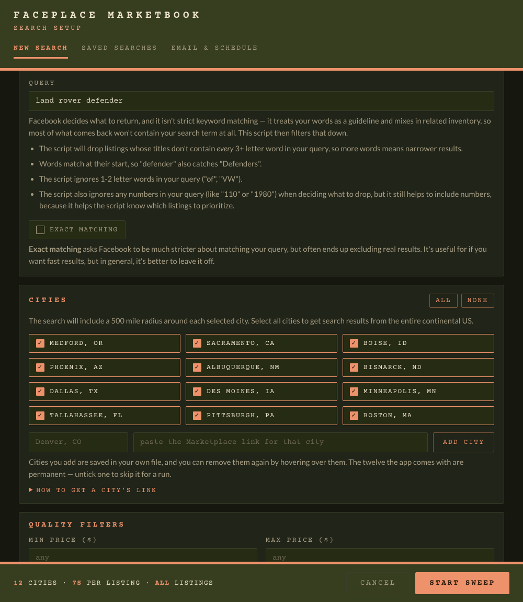
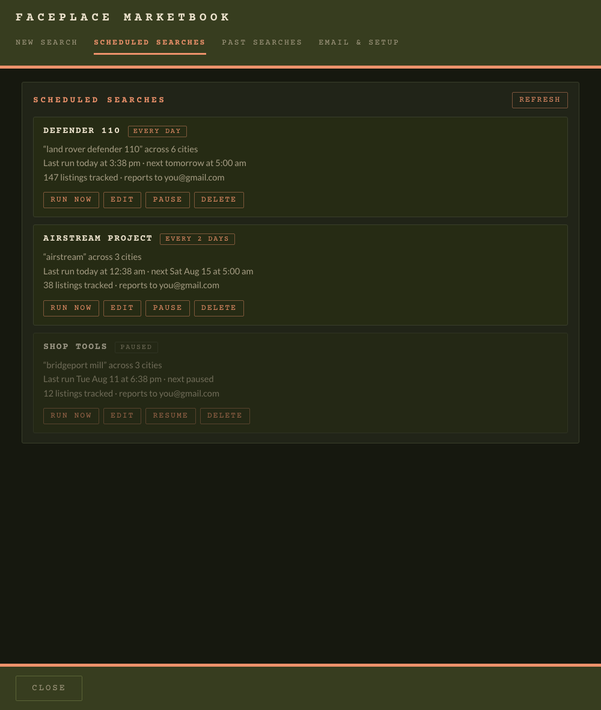
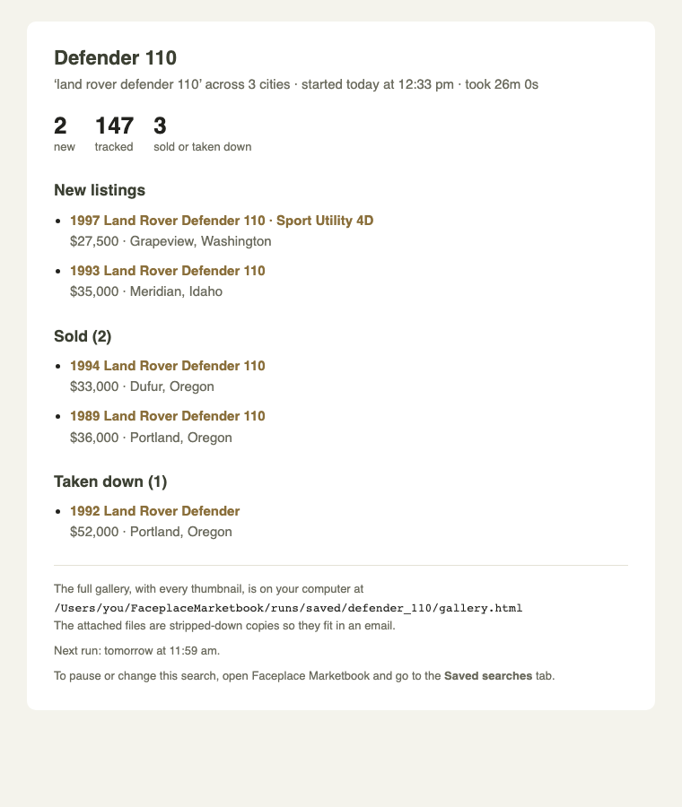
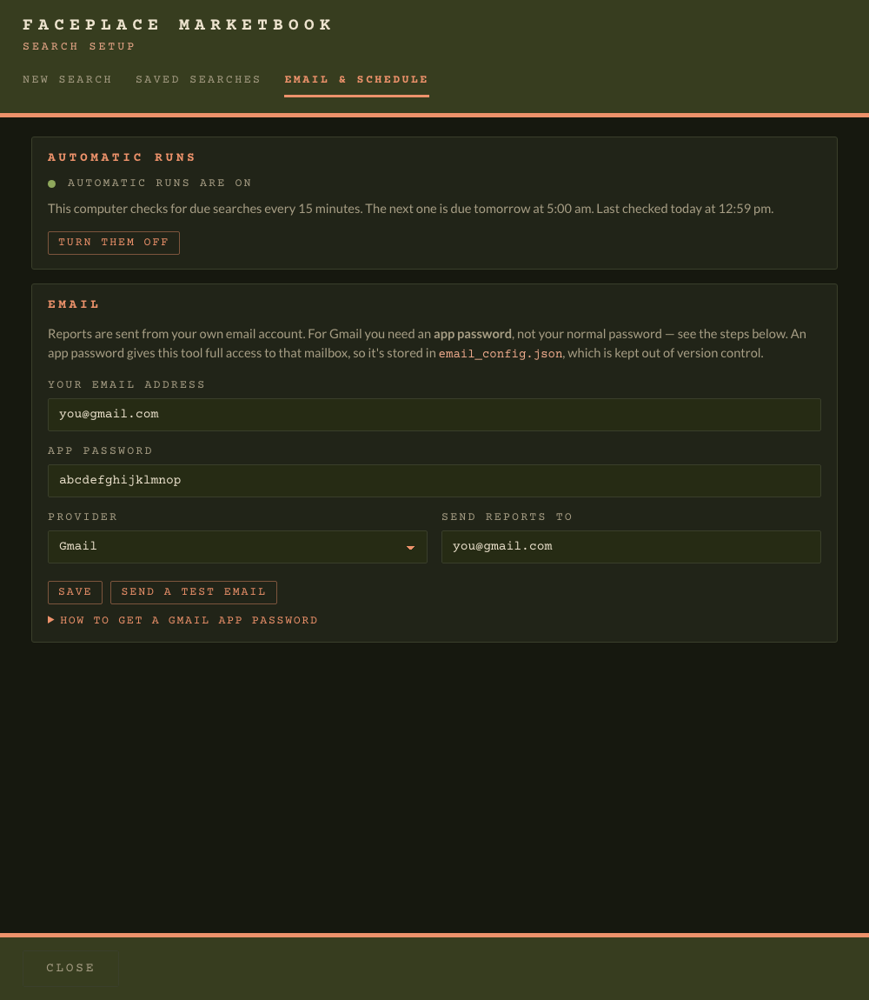

# Faceplace Marketbook

Facebook Marketplace's built-in search only covers one city at a time, and pads
the results with unrelated listings. And if you want to be the first to find
something, you have to manually check Facebook multiple times a day.

**This tool:**
- Searches as many cities as you like (the default is twelve cities with search
  radiuses that cover the entire continental US)
- Throws out the listings that don't match, so you don't have to sift through
  all the junk
- Collects each listing's photo and description, and builds a catalogue you can
  search, sort, and prune
- If desired, will automatically run scheduled searches and email you what's
  new since last time.

Works on Windows and Mac.

## Contents

- [**Please read this first**](#please-read-this-first)
- [**Overview**](#overview)
- [**Setting it up**](#setting-it-up)
  - [Step 1 — Get the folder onto your computer](#step-1--get-the-folder-onto-your-computer)
  - [Step 2 — Start it](#step-2--start-it)
  - [Step 3 — Add a shortcut on your computer, if you like](#step-3--add-a-shortcut-on-your-computer-if-you-like)
- [**Running a search**](#running-a-search)
- [**While it runs**](#while-it-runs)
- [**Your results**](#your-results)
- [**Automated searches**](#automated-searches)
  - [Mac users: check the folder location](#mac-users-check-the-folder-location)
  - [Part 1 — Give the app an email password](#part-1--give-the-app-an-email-password)
  - [Part 2 — Let your computer wake itself up](#part-2--let-your-computer-wake-itself-up)
  - [Part 3 — Save a search](#part-3--save-a-search)
  - [What the emails look like](#what-the-emails-look-like)
  - [Where scheduled results live](#where-scheduled-results-live)
- [**Troubleshooting**](#troubleshooting)

---

## Please read this first

**Automating Facebook is against their Terms of Service.** This tool runs on
your own real Facebook account, using your own login. There is a chance that
Facebook may restrict or ban your account for bot activity. By using this tool,
you acknowledge and accept this risk.

**Things to keep in mind:**
- **Keep runs occasional.** Running a search once a day is less risky than once
  every hour.
- **You log in by hand.** The first time you run a search, a browser window
  opens and you type your own password and two-factor code into Facebook,
  exactly as you normally would. Your password is never seen or stored by this
  app. Only the resulting browser session is saved on your computer, in a hidden
  folder called `.state`, so you don't have to log in every time.
- **Facebook changes their website constantly.** When they do, searches may
  start coming back empty or with missing prices. Please contact me if this
  happens so I can update the app accordingly.

---

## Overview

Every search builds a gallery like this, saved on your computer. You can search
it, sort by price or year, filter by city, star your favorite listings, and hide anything you don't want to see again.

---

This is the search setup window.

---

Scheduled searches run at an interval you choose, and can be paused, edited or
run on the spot.

---

When a scheduled search finishes, it emails you a summary.

---

## Setting it up

You only have to do this once, and it will take about 10 minutes.

### Step 1 — Get the folder onto your computer

On the project's GitHub page, click the green **Code** button, then **Download
ZIP**. Open the downloaded ZIP to unpack it, and put the resulting folder
somewhere you'll be able to find it easily.

Keep everything in that folder together. The app stores your searches and
results inside it.

### Step 2 — Start it

Open the folder and double-click the file for your computer:

- **Windows:** `Start Faceplace Marketbook (Windows).bat`
- **Mac:** `Start Faceplace Marketbook (Mac).command`

<strong>If Windows won't open it — "Windows protected your PC"</strong>

Click **More info**, then **Run anyway**. Windows shows that box for anything it
downloaded from outside the Microsoft Store.

<strong>If your Mac won't open it — "Apple could not verify ..."</strong>

1. Click Done to dismiss the popup warning.
2. Open **System Settings** → **Privacy & Security**.
3. Scroll down to the **Security** section. You'll see a line saying
   `"Start Faceplace Marketbook (Mac).command" was blocked to protect your Mac`,
   Click **Open Anyway**.
4. Click **Open Anyway** again if asked, and confirm with your password or
   Touch ID.

**Or run it from Terminal,** which always works and skips Apple's permission
entirely:

1. Press Command-Space, type `Terminal`, and press Return.
2. Drag `Start Faceplace Marketbook (Mac).command` from your folder into the
   Terminal window. It fills in the location for you.
3. Press Return.

If that says `permission denied`, unzipping stripped the file's permission to
run. Type `chmod +x` and a space, drag the file in again, press Return, and then
repeat the steps above.

 

Once you launch the program, a terminal window opens and tells you what it's
doing.

You may need to install Python if your computer doesn't have it already; if
prompted, just follow the installation steps it gives you in the terminal.

Next, it spends a couple minutes installing what it needs and downloading the
Chromium browser for itself (about 150 MB) then opens the search window. Every
time after that, it'll start up in a second or two.

### Step 3 — Add a shortcut on your computer, if you like

The Search Setup window offers this the first time it opens. Select where you
want it and click **Add shortcut**:

- **Desktop** — an icon called **Faceplace Marketbook** that you double-click to
  start a search, exactly as the Start file does.
- **Dock** (Mac) — keeps it in the Dock permanently. It also puts the app in
  your Applications folder.
- **Start menu** (Windows) — nothing on screen, but typing "faceplace" finds it.

A shortcut is the only thing any of this puts outside the app's folder. Deleting
the shortcut will not delete the app itself.

Visit the Email & Setup tab to create a shortcut later, or to replace a
shortcut that stopped working because you moved the app's folder.

---

## Running a search

Once the app opens, try running a search.

1. Fill out the search setup page. Each setting has a short explanation
   underneath it to help guide you. Don't worry about creating a Scheduled
   Search right now — that will be covered later.
2. Click **Start Search**. Facebook will automatically open in a new window.
3. Log into Facebook as you normally would, including any two-factor code or
   captcha. The app will automatically take you to Marketplace.
4. Dismiss any popups from Facebook. Then, click the location button in the
   left sidebar and set the radius you want to search around each city. The
   twelve built-in cities are spaced so that a 500-mile radius will cover the
   entire continental US; a smaller radius is fine if you only care about
   listings near the cities you picked.
5. Return to the terminal window and press Enter to start the search.

## While it runs

**The terminal window narrates as it goes:** which city it's on, how many
listings it's found, and how many survived filtering.

**Don't touch the browser window it opens.** The app is driving that window.
Clicking, scrolling, or typing will fight the app for control, and could cause
it to lose its place. You can use your computer normally otherwise, including
your own separate browser — just leave that one window alone.

**Keep your computer turned on.** The app tries to keep your computer awake
while it works, and it will continue running even if the display turns off to
save power. However, closing your laptop lid will put it to sleep, unless
there's an external display connected. Keep your computer plugged in with the
lid open so that the search doesn't get interrupted.

**You can stop it early.** Press `Control-C` in the terminal to end the search
at any time, and it will build the gallery with everything it gathered so far.
Closing the automated browser window does the same thing, but `Control-C`
allows it to wrap up more cleanly.

---

## Your results

When it finishes, the results gallery will open automatically.

Everything from the run lands in a new folder inside `runs/`, named for your
search and the date, like `runs/my_search_08-05-2026/`. If you manually run the
same search twice in a day, the second becomes `..._1`. In each folder:

- **`gallery.html`** — the browsable catalogue. The photos are baked into this
  one file, so you can move it anywhere and it still works.
- **`lightweight_gallery.html`** — the same catalogue, but it reads the photos
  out of the `thumbnails/` folder instead of carrying them. Better for
  emailing/sharing, but the images won't be visible without the thumbnails
  folder alongside it.
- **`results.csv`** — the same listings in spreadsheet format.
- **`run.json`** — a record of what was searched and what came back.
- **`thumbnails/`** — the photos as individual files.

In the gallery you can search the text, filter by which city found it, and sort
by price, year, or title (A-Z). You can also click any card to see the full
description, or click **View On Facebook** to open the listing in your browser.
Hover over a card and click the **✕** in the top right corner to hide listings
you're not interested in, or the star in the top left to mark a favorite. Your 
browser remembers what you've hidden or starred even after you close the page.

---

## Automated searches

You can save a search and have the app run it automatically on a fixed
interval. This allows you to easily find the latest listings, and also find
more listings that Facebook's algorithm didn't turn up on the first pass. Each
time it runs, it will email you a report of what it found.

These instructions describe how to set it up with Gmail, but Outlook, iCloud,
etc. should all work too.

<strong>Mac users: check the folder location (click for details)</strong>

macOS guards your **Documents**, **Desktop** and **Downloads** folders, and
won't let anything running in the background read what's inside them.

**Option 1 — move the folder somewhere macOS doesn't guard.**

1. Quit the app.
2. Open Finder and press **Command-Shift-H** to go to your home folder.
3. Drag the Faceplace Marketbook folder there.
4. Start the app again from its new home, and turn automatic runs on.

If you made desktop or Dock shortcuts, re-create them from the **Email & Setup**
tab — a shortcut points at wherever the folder used to be, so moving it leaves
the old ones pointing at nothing.

**Option 2 — leave the folder where it is, and grant access in settings.**

1. In the app, open the **Email & Setup** tab and click **Turn on**. If the
   folder location is the problem, the message that appears includes a path
   ending in `.venv/bin/python3`. Leave the window open, and copy that path.
2. Open **System Settings → Privacy & Security → Full Disk Access**.
3. Click the **+** button, and enter your password if you're asked for it.
4. In the file picker, press **Command-Shift-G**, paste the path, press Return,
   then click **Open**.
5. Make sure the switch beside the new entry is on.
6. Back in the app, click **Turn off** and then **Turn on** again. The problem
   should go away.

### Part 1 — Give the app a password to connect to your email

This is a special password just for this app. Your real Gmail password isn't
used.

1. Open Faceplace Marketbook, and click the **Email & Setup** tab at the top.
2. In your web browser:
   a. Go to **myaccount.google.com** and sign in.
   b. Click **Security & sign-in** on the left sidebar.
   c. Find **2-Step Verification**. If it's off, turn it on and follow Google's
      steps. You can't create an app password without it.
   d. Back on the Security page, use the search box at the top of the page and
      type **app passwords**. Click "App passwords" in the list of search
      results.
   e. Type a name — **Faceplace Marketbook** is fine — and click **Create**.
   f. Google shows **a sixteen-letter password**. Leave that window open.
3. Back in the app: type your Gmail address in **Your email address**, and copy
   the sixteen-letter password into **App password**. Spaces don't matter.
4. Click **Save**, then click **Send a test email**.
5. Check your email. You should have a message from yourself titled "Faceplace
   Marketbook: test message".

If it doesn't arrive, the app will tell you why in the box under the buttons.

**One thing to know about sending mail to yourself:** Gmail sometimes files a
message you sent yourself under **Sent Mail** and never puts it in your inbox.
If the test message isn't in your inbox, look there before assuming it failed.

#### Using something other than Gmail

You don't need a Gmail account. Pick your provider from the **Provider** menu:

- **Outlook / Hotmail / Live** and **iCloud** work the same way, and also need
  an app password created in their own account settings rather than your normal
  one.
- **Other** lets you type in any mail server's address and port, which is the
  route for a work account or your own domain.

### Part 2 — Let your computer wake itself up

A scheduled search can't run if the computer is asleep and stays asleep. This
part gives it permission to wake up, run the search, and go back to sleep.

1. In the app, go to the **Email & Setup** tab.
2. Under **Automatic runs**, click **Turn on**. It will take a few seconds to
   get set up, and if you're on a Mac, it will prompt you for your password.
3. Read the message that appears. It tells you if anything is left to do by
   hand.
4. Scroll down to **Computer settings**. These are settings on the computer
   itself rather than in the app — the ones that decide whether it's awake and
   willing to run a search when one comes due. Some settings are highly
   recommended, and others are optional, because you have to weigh whether
   you'd rather conserve your laptop's battery or ensure your searches always
   run on schedule.

### Part 3 — Save a search

1. Click the **New search** tab.
2. Set up your search just like you would for a normal run: query, cities,
   price limits, etc.
3. Scroll down to **Scheduled search** at the bottom.
4. Name the search, choose the email address you'd like the report to be sent
   to (it doesn't have to be your own), and choose how often the search will
   run.
5. Click **Save scheduled search**.

**Daily searches run every morning at 5am.** Searches set in hours run at fixed
times of day, starting from 5am in your local time. For example, if you select
every 6 hours, it will start a new run at 5am, 11am, 5pm and 11pm. The first
run is the next of those times to come around, but you can use **Run now** on
the Scheduled searches tab if you don't want to wait.

**On a Mac, hourly searches need periodic renewing.** A Mac can only be told
its wake-up times a few weeks ahead. Once it's down to its last week, the app
offers to renew the wakeup schedule — if you agree, your Mac will just prompt
you for your password, and you're good to go. If it does run out, nothing
breaks: hourly searches keep running once a day at 5am, and whenever the Mac
happens to be awake, and your report emails will remind you before that
happens.

> **Don't set up too many, and don't run them too often.** Every run is a full
> sweep of every city you picked, and a lot of automated traffic is what gets
> Facebook accounts limited or banned. A few automated runs per day is usually
> fine, but there's no guarantee.

The **Scheduled searches** tab lists everything you've saved. From there you can
run one immediately, edit it, pause it, or delete it.

**Neither pausing nor deleting a search touches your results.** Pausing just
stops it running, and you can resume it later. Deleting removes the schedule
and the saved settings; the results folder, the gallery, the photos and
everything the search ever found stay exactly where they are on your computer.

### What the emails look like

Each report contains:

- How many listings are new, how many are being tracked, and how many sold or
  were taken down.
- Every new listing by name, with a link.
- Every sold or removed listing by name, with its link, so you can see what you
  missed.
- Two attachments: a small gallery of just the new listings, and one of
  everything currently tracked. Photo thumbnails are not included, to avoid
  exceeding email attachment size limits. You can always view the full gallery
  by opening the app on your computer.

You'll also get an email if a search couldn't run:

- **"Please log into Facebook again"** — the saved login expired. Double-click
  **Log into Facebook** in the app's folder, log in, and you're done; the next
  scheduled run works again.
- **"The scheduled run failed"** — something else went wrong. The search stays
  scheduled and tries again next time. The email includes the details.

A report also carries a warning at the top if the run started late, which is
what you'll see if the computer was asleep or switched off at the scheduled
time.

### Where scheduled results live

Scheduled searches write to `runs/saved/<your search name>/` and **rewrite that
same folder every run**, so the folder always holds the current picture rather
than one folder per run. Previous reports are kept in a `history/` folder inside
it.

---

## Troubleshooting

**"A leftover browser window is still using this app's saved Facebook login."**
A browser window from a previous run never closed. Close any stray Chromium
window and start again.

**It asks me to log into Facebook again.** The saved session expired, or
Facebook wants to re-check. Double-click **Log into Facebook** in the app's
folder and sign in there — signing in with Safari, Chrome or Edge won't help,
because the app keeps its own separate browser login.

**One of my cities came back with nothing, or the wrong place.** If the terminal
said Facebook didn't recognise a city, the address used to add it wasn't a real
Marketplace city. Remove it (hover, click the **✕**) and add it again from a
live Marketplace address.

**No email arrived and I never saw an error.** Click **Send a test email** on
the *Email & Setup* tab. A wrong address or password can't be detected until
the mail server is asked, and a scheduled run that can't send has no way to tell
you by email. Your results are still on your computer either way.

**Hardly any results, or none.** Usually the search term is too specific, or the
excluded terms are too broad. Try fewer words. The other likely cause is the
search radius. Run it again and raise your search radius setting in Facebook.

**Some pictures say "image expired".** Facebook's photo links go stale within
hours. The app saves photos as it goes to avoid this, but a few can slip through
on a very long run. Running the search again picks them up.

**A scheduled search never ran.** Work through these in order:

1. Is it paused? Check the *Scheduled searches* tab.
2. Are automatic runs on? Check the *Email & Setup* tab — the dot should be
   green. An orange dot and **on, but blocked** means the schedule exists but
   can't reach your files; the instructions underneath say what to do.
3. Was the computer asleep with the lid shut, hibernating, or switched off? Go
   back through [Part 2](#part-2--let-your-computer-wake-itself-up).
4. On a Mac, if it's a search on an hour interval: have the wake-ups run out?
   Check under *Automatic runs* on the *Email & Setup* tab — the app offers a
   **Renew wake-ups** button there, and a notice at the top of the window when
   they're getting low.
5. If a run started but nothing arrived, the email settings are the likely
   cause. Click **Send a test email**.

**My desktop icon says it can't find the folder, or does nothing.** It holds the
folder's location, so moving or renaming the folder breaks it. Start the app
from the folder's new home, go to the *Email & Setup* tab, and click **Create a
shortcut** — that writes a fresh icon over the old one.

**It said macOS refused to create the Dock shortcut.** That happens
occasionally; the Dock is particular about being edited underneath it. The app
itself is in your Applications folder either way, so open that and drag
**Faceplace Marketbook** onto the Dock yourself.

**I moved the app's folder and scheduled runs stopped.** The schedule still
points at the old location. Go to *Email & Setup*, click **Turn off**, then
**Turn on** again.

**A scheduled run happened but no email came.** Look in **Sent Mail** as well as
your inbox. Then click **Send a test email** on the *Email & Setup* tab — it
reports exactly what went wrong.

**"Not starting: a scheduled run has been running since…"** Two runs can't share
one Facebook login, so a manual run won't start while a scheduled one is going.
Wait for it to finish. If you're sure nothing is really running — for instance
the computer lost power partway through a run — the app clears the leftover
marker by itself after 8 hours, or you can delete the file
`.state/schedule/run.lock` in the app's folder.

**A listing I know is sold still shows up.** The app only removes a listing when
it can positively confirm it's gone, because being missing from Facebook's
search results doesn't mean it was taken down — Facebook's rankings shuffle
constantly. So it errs toward keeping things. It re-checks each old listing
about once per interval, and drops it as soon as Facebook says sold or
unavailable.
